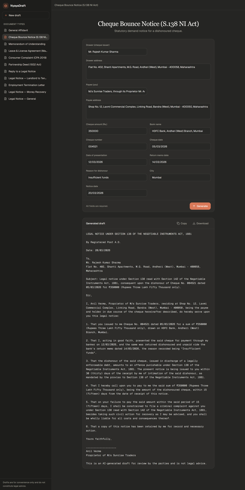

# NyayaDraft

NyayaDraft is a fine-tuned, safety-first drafting assistant for **11 common Indian
legal document types**. Vanilla LLMs are unreliable for Indian legal drafting:
they hallucinate statutory citations and silently invent names, amounts, and dates.
NyayaDraft fine-tunes a small open-weight model (Qwen 2.5 7B Instruct, QLoRA) for the
opposite behaviour — missing facts become explicit ALL-CAPS bracketed placeholders,
uncertain citations become `[VERIFY: Act/section]` markers for lawyer review, and
every draft carries a fixed not-legal-advice disclaimer. The product is a forms-only
web app: users fill in the facts they know and receive a structured draft for review.

> **Status:** Live. The fine-tuned model is trained, merged, and served in production.
>
> - **Web app:** https://nyayadraft.vercel.app (Next.js on Vercel)
> - **Backend:** Express API on [Render](https://render.com), proxying to a RunPod serverless (vLLM) endpoint
> - **Model:** [`2434addy/nyayadraft-merged`](https://huggingface.co/2434addy/nyayadraft-merged) on Hugging Face (Qwen 2.5 7B + NyayaDraft QLoRA, merged)

## Live Demo

**Try it live:** [nyayadraft.vercel.app](https://nyayadraft.vercel.app)

The screenshot below shows NyayaDraft drafting a **Section 138 (Negotiable Instruments Act, 1881) cheque-bounce demand notice** end to end. The form on the right is filled with the matter facts — drawer, payee, cheque number, amount, and the presentation/dishonour dates — and the complete statutory notice is generated below, framed under §138 r/w §142 and closing with the fixed not-legal-advice disclaimer. The sidebar lists all 11 supported document types.



## Supported document types

The app drafts these 11 document types, plus an `out_of_scope` refusal behaviour
for legal-advice requests, outcome predictions, and unsupported document types.

| # | Doc type id | Document |
|---|-------------|----------|
| 1 | `affidavit_general` | General affidavit |
| 2 | `cheque_bounce_138` | Cheque bounce demand notice (Section 138, Negotiable Instruments Act, 1881) |
| 3 | `mou_two_parties` | Memorandum of Understanding (two parties) |
| 4 | `leave_license_mh` | Leave & License Agreement (Maharashtra) |
| 5 | `consumer_complaint_cpa2019` | Consumer complaint (Consumer Protection Act, 2019) |
| 6 | `partnership_deed_1932` | Partnership deed (Indian Partnership Act, 1932) |
| 7 | `reply_to_legal_notice` | Reply to a legal notice |
| 8 | `legal_notice_landlord_tenant` | Legal notice — landlord to tenant |
| 9 | `employment_offer_termination` | Employment offer / termination letter |
| 10 | `legal_notice_money_recovery` | Legal notice for recovery of money |
| 11 | `legal_notice_general` | General-purpose legal notice |
| — | `out_of_scope` | Refusal category: legal-advice requests, unsupported document types, and outcome predictions are politely declined |

`doc_type` ids are the lingua franca across the whole repo — the app catalogue
(`nyayadraft/lib/documents.ts`), the prompt templates, the rule files
(`legal_rules/rules/`), and the data-pipeline specs all key off them.

## Architecture

```
Browser — Next.js form (nyayadraft/app/page.tsx)            [Vercel]
   │  POST /api/generate  { doc_type, details }
   ▼
Next.js route (nyayadraft/app/api/generate/route.ts)        [Vercel]
   │  thin proxy → ${NEXT_PUBLIC_API_URL}/api/generate
   ▼
Express backend (backend/src/server.ts)                     [Render]
   │  1. buildPrompt(doc_type, details)        ← lib/prompt-templates.ts
   │  2. POST RunPod /run { input: { prompt, sampling_params } }
   │  3. poll /status/<id> until COMPLETED, then clean the output
   ▼
RunPod serverless vLLM worker                               [RunPod]
   │  serves 2434addy/nyayadraft-merged
   ▼
{ text }  → rendered in the app (copy / download as .txt)
```

The generation loop (prompt building, the RunPod run/poll cycle, output cleaning)
lives in the standalone Express service so it runs without serverless function
time limits; the Next.js route is now a thin proxy that forwards the request body
and relays the backend's `{ text }` / `{ error }` response.

### Tech stack

| Layer | Stack |
|-------|-------|
| Frontend | Next.js 14 (App Router) · TypeScript · Tailwind CSS · shadcn/ui (Radix) |
| Backend | Node.js (≥ 22) · Express 4 · TypeScript |
| Inference | RunPod serverless · vLLM worker |
| Model | Qwen 2.5 7B Instruct base + NyayaDraft QLoRA adapter, merged for serving |
| Training / data | Python · transformers · peft · trl · bitsandbytes · datasets |
| Rule engine | Python (`legal_rules/`), shared by the data pipeline and the eval harness |

## Repository layout

```
.
├── nyayadraft/          # Next.js 14 frontend (deployed on Vercel)
├── backend/             # Express API: RunPod proxy + run/poll loop (deployed on Render)
├── finetune/            # QLoRA training, scenario-stratified split, held-out eval
├── data-pipeline/       # synthetic training-data generation + variation engine
├── legal_rules/         # JSON-driven statutory/structural rule engine (shared)
│   ├── checker.py       #   compiles rules/<doc_type>.json and checks documents
│   └── rules/           #   per-doc-type required/forbidden patterns, length bounds
├── docs/                # cost tracking (₹) + lawyer claim audit (CLAIM_AUDIT.md)
├── out/                 # generated datasets / adapter archives (gitignored)
├── test_model.py        # CPU smoke test: base Qwen + published adapter → one affidavit
├── LICENSE
└── README.md
```

## Run locally

The frontend and backend are separate apps. For local development, run the backend
first, then point the frontend at it.

### 1. Backend (Express → RunPod)

```bash
cd backend
npm install
cp .env.example .env          # fill in your RunPod values (see env vars below)
npm run build && node server.js   # http://localhost:3001
# or: npm run dev               # TypeScript with hot reload (tsx)
```

Smoke test:

```bash
curl -X POST http://localhost:3001/api/generate \
  -H "Content-Type: application/json" \
  -d '{"doc_type":"affidavit_general","details":{"name":"Test","city":"Mumbai"}}'
```

### 2. Frontend (Next.js)

```bash
cd nyayadraft
npm install
# point the app at the backend from step 1:
echo "NEXT_PUBLIC_API_URL=http://localhost:3001" > .env.local
npm run dev                    # http://localhost:3000
```

Node.js ≥ 22 is required for the backend (the poll loop uses
`Promise.withResolvers`).

### Environment variables

**Frontend** (`nyayadraft/.env.local`, or Vercel project settings):

| Variable | Required | Description |
|----------|----------|-------------|
| `NEXT_PUBLIC_API_URL` | yes | Base URL of the Express backend, no trailing slash (e.g. `http://localhost:3001` locally, your Render URL in production). |

**Backend** (`backend/.env`, or Render service settings):

| Variable | Required | Description |
|----------|----------|-------------|
| `RUNPOD_API_URL` | yes | The `/run` endpoint of your RunPod serverless deployment. |
| `RUNPOD_API_KEY` | yes | RunPod API key (sent as `Authorization: Bearer <key>`). |
| `FRONTEND_ORIGIN` | no | Comma-separated allowed CORS origins (your Vercel URL). Unset reflects the request origin. |
| `PORT` | no | Listen port; defaults to `3001`. Render injects this automatically. |

**Data pipeline / training** (repo-root `.env`, only needed to regenerate data or run the optional eval judge):

| Variable | Required | Description |
|----------|----------|-------------|
| `ANTHROPIC_API_KEY` | optional | Used by the data pipeline's Anthropic generation path and the optional LLM-as-judge in eval. |
| `WANDB_API_KEY` | optional | Weights & Biases training logs. |

## Model & fine-tuning

- **Base:** `Qwen/Qwen2.5-7B-Instruct` (open weights, no gating).
- **Adapter:** [`2434addy/qwen2.5-7b-nyayadraft-qlora`](https://huggingface.co/2434addy/qwen2.5-7b-nyayadraft-qlora) — 4-bit NF4 QLoRA (`r=16, alpha=32`) on all attention + MLP projections, completion-only loss (system + user prompt masked).
- **Served model:** [`2434addy/nyayadraft-merged`](https://huggingface.co/2434addy/nyayadraft-merged) — the adapter merged into the base and loaded by the RunPod vLLM worker.
- **Data:** scenario-stratified 80/10/10 split — every `(doc_type, scenario_id)` lives in exactly one split, so validation/test are *unseen scenarios* (no phrasing leakage).
- **Eval:** each generated document is scored against the same `legal_rules` gate that built the dataset (`gate_pass`, `required_match`, `forbidden_clean`, `length_ok`, `disclaimer_ok`), with an optional Claude judge.

Training is GPU-only and fully reproducible from `finetune/` — see
[`finetune/README.md`](finetune/README.md) for GPU tiers, commands, and the eval harness.
`test_model.py` is a CPU smoke test that loads the base model + published adapter and
drafts one affidavit.

## How the data pipeline works

`legal_rules/` is the single source of truth for what a valid document looks like;
both the data pipeline (generation gate) and the eval harness import it, so both
score against identical rules.

1. **Meta-prompt spec per doc type** (`data-pipeline/meta_prompts/<doc_type>.json`): structural summary, statutory requirements, and a field list where each field is `always` given, `withholdable`, or `optional`.
2. **Variation engine**: seed names/cities/scenarios are combined with a register mix (casual / semi-formal / detailed user instructions). Withholdable fields are dropped from the user request with a per-register probability, so the model learns to emit bracketed placeholders instead of inventing facts.
3. **Statutory regex gates** (`legal_rules/`): every generated document must match the required patterns for its type (e.g. for the Section 138 notice: the 15-day demand, the cheque particulars), must not match forbidden patterns, and must end with the exact disclaimer footer. Failures are rejected.
4. **Generation with a hard cost guard**: the Anthropic generation path uses the Batches API (50% cheaper than sync); any run larger than `sample_max` prints the estimated cost in ₹ and aborts unless the operator types `YES`.
5. **Scenario-held-out splits**: 80/10/10 train/val/test, split **by scenario** so no scenario leaks across splits. Near-duplicate instructions are removed by fuzzy matching.
6. **Lawyer-review gates**: a small sample gate first, then a per-type pilot reviewed in full by a lawyer, and only then the full run — from which a random 5% is exported to CSV for lawyer review.

The pipeline and rule engine cover **ten** of the document types plus the
`out_of_scope` refusal category (see `data-pipeline/config.yaml`); the app's
eleventh type, `legal_notice_general`, reuses the general legal-notice drafting the
model learned from the two specific notice types.

## Safety and legal-accuracy rules

These are non-negotiable and enforced in the system prompt
(`data-pipeline/system_prompt.txt` is the authoritative wording) and the rule
engine (`legal_rules/`):

1. **No invented facts.** The model never invents names, addresses, amounts, dates, or ID/cheque numbers. Every missing fact becomes an ALL-CAPS bracketed placeholder, e.g. `[FULL NAME OF LANDLORD]`, `[CHEQUE NUMBER]`, `[AMOUNT IN ₹]`.
2. **No invented citations.** An Act, section, or rule is cited only when correct and applicable. Where a citation is customary but uncertain, the model writes `[VERIFY: Act/section]` for lawyer review.
3. **Mandatory disclaimer footer.** Every generated document ends with the exact line: *"This is an AI-generated draft for review by the parties and is not legal advice."* The rule engine rejects documents missing it (and rejects refusal texts that carry it).
4. **Claim audit.** Every statutory claim encoded in the rule files is tagged `CONFIDENT` or `VERIFY`; the `VERIFY` items are collected in [`docs/CLAIM_AUDIT.md`](docs/CLAIM_AUDIT.md) for review by a qualified advocate.

## Disclaimer

**This software, the datasets it produces, and the model trained with it generate
AI drafts — not legal advice.** Outputs are first drafts intended for review by the
parties and, where appropriate, a qualified advocate. Nothing in this repository
creates an advocate–client relationship, and it is not a substitute for consulting
a qualified advocate licensed to practise in India. Use at your own risk.

## License

[MIT](LICENSE) — Copyright (c) 2026 Aditya Pandey.
